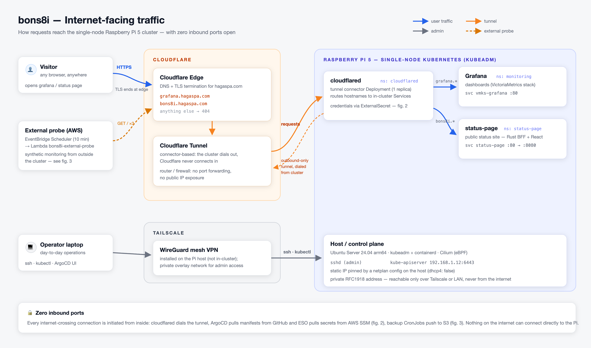
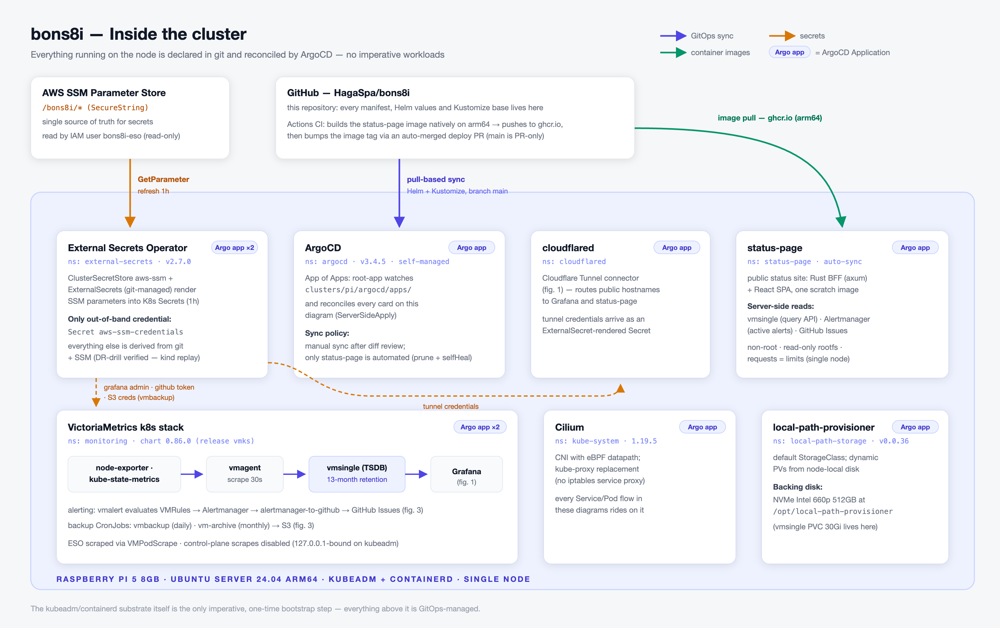
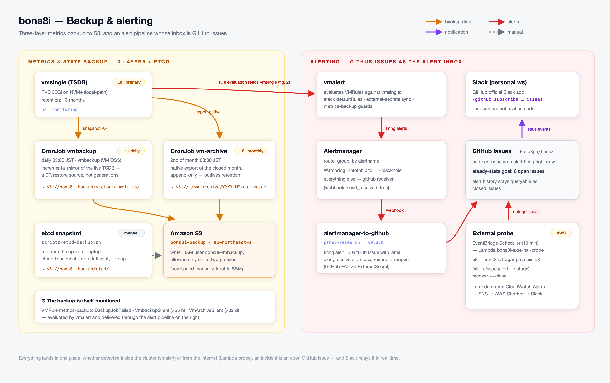

# clusters/pi/

Bootstrap materials and GitOps manifests for the single-node **Raspberry Pi 5**
cluster (`kubeadm`, Ubuntu Server 24.04 arm64).

## Architecture

Three views, one system. Editable sources are the SVGs in
[`architecture/`](architecture/); after editing, regenerate the PNGs with
[`scripts/render-architecture/`](../../scripts/render-architecture/)
(`npm ci && npm run render` — puppeteer ships its own pinned Chromium, so
the only host requirement is Node.js).

### 1. Internet-facing traffic

How requests reach the cluster — Cloudflare Tunnel for public traffic,
Tailscale for admin access, and zero inbound ports on the router.

### 2. Inside the cluster

Every workload is declared in this repository and reconciled by ArgoCD
(pull-based GitOps) — there is no remaining imperative Kubernetes workload.
The one inherent exception is the cluster substrate itself (`kubeadm`,
`containerd`): it sits below the Kubernetes API, so it is a one-time
imperative bootstrap step by nature, not a GitOps target.

### 3. Backup & alerting

Three-layer metrics backup (live TSDB → daily S3 mirror → monthly append-only
archive) plus manual etcd snapshots, and an alert pipeline whose inbox is
GitHub Issues.

## Components

| Component | Purpose | Delivery method | Status |
|---|---|---|---|
| `kubeadm` + `containerd` | Cluster bootstrap: control plane, kubelet, CRI | Manual, one-time (predates Kubernetes; not a GitOps target) | Not GitOps-managed (cluster substrate) |
| **Cilium** 1.19.5 | CNI, kube-proxy replacement (eBPF) | ArgoCD Helm source Application (values inline) | Adopted from an imperative `helm` release |
| **local-path-provisioner** v0.0.36 | Default `StorageClass`, dynamic PV provisioning from the NVMe disk | ArgoCD git source Application, Kustomize **remote base** pointing at the upstream repo | Adopted from an imperative `kubectl apply` |
| **ArgoCD** | GitOps controller (App of Apps, self-managed) | Self-managed: git source Application, Kustomize remote base pointing at the official install manifests | Bootstrap |
| **External Secrets Operator** | Renders AWS SSM Parameter Store (`/bons8i/*`, SecureString) into K8s Secrets; the only out-of-band credential is the `aws-ssm-credentials` Secret | ArgoCD Helm source Application + git source Application (`ClusterSecretStore`, `ExternalSecret`s) | Native GitOps (replaced sealed-secrets) |
| **VictoriaMetrics k8s stack** (vmsingle, vmagent, vmalert, alertmanager, kube-state-metrics, node-exporter, Grafana) | Metrics collection (13-month retention), alert evaluation, dashboards | ArgoCD Helm source Application (values inline) | Native GitOps |
| **vmbackup / vm-archive CronJobs** | Daily S3 mirror of the TSDB + monthly append-only archive that outlives retention | ArgoCD git source Application (`monitoring/`) | Native GitOps |
| **alertmanager-to-github** ([pfnet-research](https://github.com/pfnet-research/alertmanager-to-github)) | Turns firing Alertmanager alerts into GitHub Issues with an open/close/reopen lifecycle | ArgoCD git source Application (custom Deployment/Service manifests) | Native GitOps |
| **cloudflared** | Cloudflare Tunnel connector — publishes Grafana and status-page with zero inbound ports; TLS terminates at the Cloudflare edge | ArgoCD git source Application | Native GitOps |
| **status-page** | Public status site (Rust BFF + React SPA, single scratch image); image built on arm64 by GitHub Actions, deployed via an auto-merged image-bump PR | ArgoCD git source Application (**auto-sync**: prune + selfHeal) | Native GitOps |
| **Tailscale** | Remote ssh / kubectl access for day-to-day operations | Installed on the host, outside the cluster | N/A |
| **External probe** (AWS Lambda) | Synthetic monitoring of `bons8i.hagaspa.com` every 10 min from outside the cluster; files GitHub Issues on outage | Terraform (`infra/aws/`), outside the cluster | N/A (cluster-external) |

## Operations

- **Public endpoints**: `grafana.hagaspa.com` and `bons8i.hagaspa.com` are
  published through a Cloudflare Tunnel. `cloudflared` dials out from the
  cluster, so no router port is forwarded and no public IP is exposed; TLS
  terminates at the Cloudflare edge.
- **Alert-to-issue pipeline**: `VMRule → vmalert → Alertmanager → alertmanager-to-github → GitHub Issue`.
  An open issue means an alert is *currently firing*; it auto-closes when the
  alert resolves and reopens on recurrence. The steady-state goal is **zero
  open issues** — if one is open, it's a real problem.
- **Real-time notification**: the GitHub repository is subscribed in a
  personal Slack workspace via GitHub's official Slack app
  (`/github subscribe <owner>/<repo> issues`). Zero custom code — no
  webhook receiver runs on the cluster.
- **Backup**: three layers for metrics — the live TSDB on NVMe (13-month
  retention), a daily `vmbackup` mirror to S3, and a monthly `vm-archive`
  native export that is append-only and outlives retention — plus manual etcd
  snapshots via [`scripts/etcd-backup.sh`](../../scripts/etcd-backup.sh).
  The backup jobs are themselves monitored by the `metrics-backup` VMRule.
  Secret recovery is covered by [`docs/runbook/dr-secrets.md`](../../docs/runbook/dr-secrets.md)
  and rehearsed end-to-end with [`scripts/dr-drill.sh`](../../scripts/dr-drill.sh).
- **Remote access**: Tailscale is used for day-to-day `ssh`/`kubectl`, so no
  inbound port is exposed to the internet.
- **Change control**: the `main` branch is protected on GitHub (no direct
  pushes), and a local pre-commit hook additionally blocks committing
  directly to `main`/`master` on this machine. All changes land through a
  PR.
- **Manifest convention**: when upstream ships a Helm chart, it's adopted as
  an ArgoCD Helm source Application with values inlined. When upstream ships
  plain YAML and publishes a `kustomization.yaml`, it's adopted via a
  Kustomize **remote base** (see `local-path/` and `argocd/bootstrap/`) so
  only the local customization (as a patch) lives in this repo — not a full
  copy of upstream. Plain YAML without a `kustomization.yaml`, or fully
  custom manifests (e.g. `alertmanager-to-github`), are kept as regular
  Kustomize resources in this repo.
