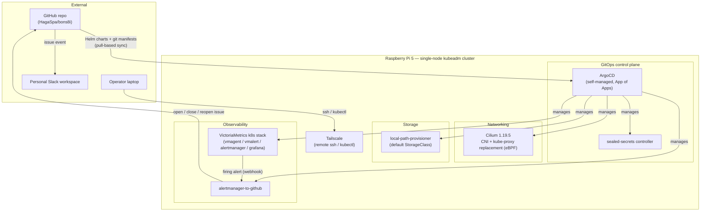

# clusters/pi/

Bootstrap materials and GitOps manifests for the single-node **Raspberry Pi 5**
cluster (`kubeadm`, Ubuntu Server 24.04 arm64).

## Architecture



Everything running on the cluster is declared in this repository and
reconciled by ArgoCD (pull-based GitOps) — there is no remaining imperative
workload.

## Components

| Component | Purpose | Delivery method | Status |
|---|---|---|---|
| `kubeadm` + `containerd` | Cluster bootstrap: control plane, kubelet, CRI | Manual, one-time (see [Bootstrap history](#bootstrap-history-pre-gitops)) | Not GitOps-managed (cluster substrate) |
| **Cilium** 1.19.5 | CNI, kube-proxy replacement (eBPF) | ArgoCD Helm source Application (values inline) | Adopted from an imperative `helm` release |
| **local-path-provisioner** v0.0.36 | Default `StorageClass`, dynamic PV provisioning from node-local disk | ArgoCD git source Application, Kustomize **remote base** pointing at the upstream repo | Adopted from an imperative `kubectl apply` |
| **ArgoCD** | GitOps controller | Self-managed: git source Application, Kustomize remote base pointing at the official install manifests | Bootstrap |
| **sealed-secrets** | Encrypts secrets so they can be committed to git | ArgoCD Helm source Application | Native GitOps |
| **VictoriaMetrics k8s stack** (vmsingle, vmagent, vmalert, alertmanager, kube-state-metrics, node-exporter, Grafana) | Metrics collection, alert evaluation, dashboards | ArgoCD Helm source Application (values inline) | Native GitOps |
| **alertmanager-to-github** ([pfnet-research](https://github.com/pfnet-research/alertmanager-to-github)) | Turns firing Alertmanager alerts into GitHub Issues with an open/close/reopen lifecycle | ArgoCD git source Application (custom Deployment/Service manifests) | Native GitOps |
| **Tailscale** | Remote ssh / kubectl access for day-to-day operations | Installed on the host, outside the cluster | N/A |

## Operations

- **Alert-to-issue pipeline**: `VMRule → vmalert → Alertmanager → alertmanager-to-github → GitHub Issue`.
  An open issue means an alert is *currently firing*; it auto-closes when the
  alert resolves and reopens on recurrence. The steady-state goal is **zero
  open issues** — if one is open, it's a real problem.
- **Real-time notification**: the GitHub repository is subscribed in a
  personal Slack workspace via GitHub's official Slack app
  (`/github subscribe <owner>/<repo> issues`). Zero custom code — no
  webhook receiver runs on the cluster.
- **Remote access**: Tailscale is used for day-to-day `ssh`/`kubectl`, so no
  inbound port is exposed to the internet.
- **Change control**: the `main` branch is protected on GitHub (no direct
  pushes), and a local pre-commit hook additionally blocks committing
  directly to `main`/`master` on this machine. All changes land through a
  PR.
- **Manifest convention**: when upstream ships a Helm chart, it's adopted as
  an ArgoCD Helm source Application with values inlined. When upstream ships
  plain YAML and publishes a `kustomization.yaml`, it's adopted via a
  Kustomize **remote base** (see `local-path/` and `argocd/bootstrap/`) so
  only the local customization (as a patch) lives in this repo — not a full
  copy of upstream. Plain YAML without a `kustomization.yaml`, or fully
  custom manifests (e.g. `alertmanager-to-github`), are kept as regular
  Kustomize resources in this repo.

## Bootstrap history (pre-GitOps)

The steps below describe how the cluster substrate (`kubeadm`, `containerd`,
initial Cilium install) was built imperatively, before GitOps was adopted.
They are kept for reference; Cilium itself is now managed by ArgoCD (see the
Components table above).

The cluster is created with `kubeadm init --pod-network-cidr=10.244.0.0/16`.
Unlike kind, `kubeadm` installs kube-proxy, so it must be removed after Cilium
takes over Service routing.

> Replace `<node-ip>` with the API server address used at `kubeadm init`
> (`--apiserver-advertise-address`), which also appears as `k8sServiceHost` in
> `cilium-values.yaml`.

### Install Cilium

Cilium is pinned to **1.19.5** (latest stable; the 1.16.x line is EOL).

```bash
helm repo add cilium https://helm.cilium.io/
helm repo update
helm install cilium cilium/cilium --version 1.19.5 \
  --namespace kube-system \
  -f clusters/pi/cilium-values.yaml
```

After the agent rolls out, the node moves to `Ready` and
`/etc/cni/net.d/05-cilium.conflist` appears.

### Remove kube-proxy

Delete the kube-proxy addon left by `kubeadm init`, then clear its `iptables`
rules by rebooting the node (simplest on a single node):

```bash
kubectl -n kube-system delete ds kube-proxy
kubectl -n kube-system delete cm kube-proxy
sudo reboot
```

### Verify

```bash
kubectl get nodes                                  # Ready
sudo iptables-save | grep -c KUBE-SVC              # 0 (kube-proxy Service chains gone)
kubectl -n kube-system exec ds/cilium -- cilium-dbg status | grep -i kubeproxy
#   KubeProxyReplacement: True [eth0 <node-ip> ... (Direct Routing)]

# allow workloads on the single (control-plane) node
kubectl taint nodes <node-name> node-role.kubernetes.io/control-plane:NoSchedule-

# end-to-end: a pod resolving a Service ClusterIP proves routing works without kube-proxy
kubectl run test --image=nginx --restart=Never
kubectl run dns --rm -it --image=busybox:1.36 --restart=Never -- nslookup kubernetes
kubectl delete pod test
```

### Notes

- The single node runs the control plane and workloads (the control-plane taint
  is removed). A second node can join later without downtime.
- The Cilium operator defaults to 2 replicas with anti-affinity, so one replica
  stays `Pending` on a single-node cluster. `operator.replicas: 1` is set in
  `cilium-values.yaml` to clear it.
